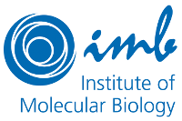
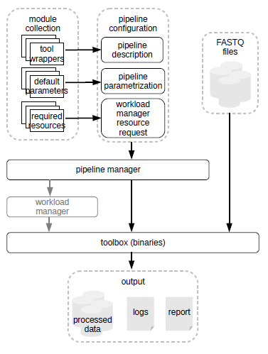

# NGSpipe2go #

An opinionated framework for building pipelines. It comprises set of NGS data analysis tools and pipelines developed and utilised at the Institute of Molecular Biology gGmbH in Mainz (https://www.imb.de/).

## DNAampliconseq_MPS pipeline

This pipeline performs multiplexed protein stability (MPS) profiling of DNA amplicon-seq data as described in the [publication](https://www.sciencedirect.com/science/article/pii/S1097276518302363) of Kats I, Khmelinskii A, Kschonsak M, Huber F, Knieß RA, Bartosik A, Knop M (2018). *Mapping Degradation Signals and Pathways in a Eukaryotic N-terminome.* Mol Cell. 2018 May 3;70(3):488-501.e5. doi: 10.1016/j.molcel.2018.03.033. It is designed as alternative or addition to the [CombinatorialProfiler](https://github.com/ilia-kats/CombinatorialProfiler) tool allowing for flexible amplicon design and UMI-deduplication. Barcode extraction and UMI deduplication is implemented using [UMI-tools](https://umi-tools.readthedocs.io/en/latest/index.html). The downstream processing of the count data to calculate protein stabilty indicies is analogous to CombinatorialProfiler. All processing steps are illustrated in the pipeline [flowchart](https://www.draw.io/?lightbox=1&highlight=0000ff&edit=_blank&layers=1&nav=1&title=MPSprofiling#R7V1bd9q6Ev41rLX7AAtsMPAY0tKmq02yk%2BzT3f2SZWwBaozl%2BpKE%2FvozkixfhTFgbGjatA2WhSxpxjPfXCS11MvV60dXd5ZfiYmsltI1X1vq%2B5ai9NTBAH7RkjUvGSojXrBwsRlWigvu8S8UFnbD0gCbyEtV9AmxfOykCw1i28jwU2W665KXdLU5sdJPdfQFyhXcG7qVL%2F2GTX8Zlva0cXzjE8KLZfjokTLkN2a68bRwSWCHz7OJjfidlS6aCcfoLXWTvCSK1A8t9dIlxOefVq%2BXyKLTKmaMf2%2B64W7UZRfZfpkvfOp%2Bni%2BvR771vLybXX%2B6nz7%2B%2BtQWBHjWrSCci5aiWdDgxMTPdHYtvLDZDe1nQLs6cdk0RJfwaRH%2BZl%2BbudkS6BJrS5SyyfDXYu6X%2FsqCTz24Z%2BkzZE2iKb0kFnFZJXXK%2FkAVz3fJU0QkmMTJnNh%2ByFE9jfZb95bIDFtk7URXc2xZyUYV%2BhM1Ku4wGqqThaubGOY2U2yQFTbgskurWLrnhZ8j8nbZY33dx4ROXHvcjUadJFZIv2fk%2Bug1URQS7yMiK%2BS7a6gS3h0NNP6V8B1rj0LmfElw7DAsWyaYtd9VwzclfEsWUdsxu8CHkGPk3PNsXP99%2Fy34HLz%2F9d%2FD1cP0u%2Ff8X7v3ptnng0Z%2FjsE%2BFXCLMuqmuCUStQlu6Xcl3KKJiodwy69v%2FvuH7r%2F%2FfZ7efXBXPfPh4%2FqqPejliIdMEMPhJXH9JVkQW7c%2BxKUJCtCJiet8IcQJyfID%2Bf46JKEe%2BASKEkyBXrH%2FL%2F16ZxBefU%2Fcef8atswu1uLChvEmvkQvvyfvxV9jV%2FH3zAuqjeDSoLSllKaFU2yJ7uQZMMVwGynvkcA1UMG7GL7jvu4ukF9UL6xIp76QkVxkgQx7TmvIQ5jig%2FbeGP8KrBvzf%2BvZzcfg8sp8aGu%2FO0%2FkCS6d%2F8qIfvNw8%2FRjOXr8%2Be%2BDr0wfr7%2F1tFm73ySJh%2BdC4rpJJa3XHx1IK%2FZVEEP6OlHBIdj2vUTLt7QgVhf90SClLtRBBkxm6g9Go6L68IH3IOaaaCj7ww21GGykYQPV6ymuE4iD3mh7jG8uoEKv77xK4Mil0rqYrHRsU3JjB1kY1DcUToqRCn9qMYDZ2mVhHolO9TbDJZ1qbxfNU%2FWXvk%2FtpgtKDmW6wD4Ao45rOR0bOE%2BZ4tVsToAL4eP1x3s6OGVB4KIN%2F2YWmdH%2Bomdq4U3FyIFzpu%2BvL%2FSVY2GwwTz0M1fw%2BPX2viPqdwCBked1st9dI0Q7cSG8b23fDWxD9%2BFVT9bdk2qlehQRbxpPZjfxNyKafjh992a%2FSpi4zWQX9vUZfDvBxmCnozm2MbNQlO5fM3rnXZV83fy4LaKbHhObnoMMJjjBWqcDpbY5MQOLMvX5jw95HqgirFPhqdtmNLg2HTaeAwJl6koH2YvcvQZcAQ%2B%2BIiPw6XwneHBDTzZbd0cwikYSm0iYP0mbqKdUYBPJtb1EpWWmACxDh34Ey9EBG5IOnmMfAVRGoiDyUPWl01WoU0vPYS83ZYpkxkTZbqglBzPaShqWDNMNkPncoyotQ4QKoEZv0CRoFZ%2B%2FpwDsNrskZZXERsqOdsk%2B2LanlDU%2Ba7I9%2F%2FGQezP7QV3FICqpW0iCFyUibUZeqUTD9oLLtBlxTeS2oZhCA4YUQsZnEq8LXD6I7iR9wRcMSqioT3%2BiGo5umlHbSpGCaBLXcSp6Hf815afbBcDxwaQb2h93%2FRaTsQPIlChhgeHyLLuZH7P6Ga3SI4C3xXN0gzFkosFurlbEtolaymbe9WfEXOcKc6jSN0UJenWQi1fITrFJblriL%2BSbECVY1mbXBviTaAiXapwW5jtdMAwvmD0ytFP9aKhYcSh%2B8ih3MiRF5lQkwj%2BwcqRPlQ20ZE92Hnpg458Beow6%2BIjN6gbPm2Qam0LdOY6BrLTxI5HXgXcbmXSMcwwjTPLU4WPkE0jnbwm4gb287kpQ2V%2By0dtOwO7onv8zw9R1zsPc1Q1uOVY1%2BLhFPl4mmZjC9%2FDCpsK0C0iJc%2FsMFz%2F4SIPe9tidxosBJVJAYQerGeVlPmo6VmbGAQJGtof9dYPD1V2DmOyFNtEqoIF4i3a5qhkI2%2Bd8Hj%2BkTZ9CNY3S%2FQvTObERAkBd7Jo40hR0Op3qxkvgFWbj1H2dDW5hEzcxsKplNS2UaWEGaBiSSNrbxZaQkoDooemUsIqo4YgN3boIA70%2BNXUmIuxroTkbPtSaWywuNmehsKTR87LEProHIEJbfHF1J%2BrXYbZ%2B2tTvDWSGq8xyFTkfO5gbcJmwOHYwM6PckD9mZhPWo9zpkGUddaylm%2BD2cPit6n0PInfqD1OU8T0Ij9nZ%2BB4cqRm3gu6DrmeWWteJ3Q28vM3EKr2nJe6BJPTboai9YLjJ5k7eTbk1ouA2jgTIfMOzUqrIyZYtc7X2GirXGfTmSO4hmSQs6CZdA5HrvfOsu96BIa%2FQat3QZI4KpX0JOSodhyYZvOO45BkzfJeMTyR4jQN6mIhWKi5l4SeUMWYBG1Jk3BLhDRctAkt3eS0XmgfDwYuAZAws4d3IGCrbQBYbLwueXEM3UxQI%2FXkbR8m%2FRmdWGnWRo9nSoC9Bw61wTSmGa6cHzPpqPo1RCsx6g1GNwEyWa1BrYEY88GQjM%2F00GY8QmZGmMjWaRHh24Kh%2FYuCo5NsnC4ueInoCLDDHi8Blyd7JfII%2FEEpAKD5FtJxW6%2FDLSsCSvMGNYMhzdFtCA1lxFhUUNVHX9AHW0VczC1UDNCWt7Y8xN8xsTdCzCV6mi5OqIUSmpY3TnJcfO%2FBzY3ZAroAlnlHJ%2BULcJ5rDxNq29QWDyQDnmUbzIrQvw8oS2B2xM9dG0DzXMuwzIChhJPBGLWIIgR2G0QALrD3stfiyM68DH74Sz2f3fUSNjyeEHGaMzPXAYvlQABiwvWB1rxi6Jxv6Kx0qexg3CKh9ELfLbiTYxwrcRNz2HX3y9mmmjB2mXYWrVUQDdOxWimVZiqtElha7v2Ved1lZxnY5aVNEE1k%2FW33ER1tRJfKdGrQ7%2BrvO4huxO9S3Z3hUtTSp9Nok7UR8tBF8n%2Bqe%2F%2FclU3llsP3PAKQaC9yCKIXptISGcfUX1m2WtEs7CwbEE39mdfAkSmumNeF%2FlilgdHhxhDG2upA4uTa6kGTiJyPLw7SiL%2BzqvaptkOBs6WXYcDfN9xUI90E3vURF6Q9zgqqnSSSVKKvDz6Tm5f3X23tAOKADeSA8tjYz0ofar4mpD83X9KzSqcxGaFfYNJlwylApLrkL50JtbVjbypY3szgyJ1y4ugi6NZjAX5i%2FSypuBtDNS7juxdfwl1Z3%2FUuAX76rY0ZeBIz6gjy%2FlV%2BOWwEjqCP68DQrlNPzan9nTsiRXdNc7cd86aye9KVqvhL8dK22e2ezFLZKb5QQ79vXwHVPyh0l%2Br2XO4qtightqe4e7qebwA%2Fzvohl0hf8Iqek4OZPo0hBNedqiiw0Eg0DczONx2vifpeJfByed5IUL2L1%2F1RfYYvy%2BydkPSPaai3Gx1DoowL9JJVKe%2Binknw%2BPDE%2B7%2BZY3UUemMmFntam%2FapxCNIAgZ1g%2BSYcY7f3V2zZFfM52IFhIeJz3wl3hQDr2wSUPv3soZ8Bso3ipNJa%2FUhvXiYMlHGnpE9idDTtNzp5qWCRxYmKBOhZW2g8g1gWmAfM4ce1H9KNZSt2Y54Wix%2BBnTXhzapDxcmBd96ddqJenCqBt8DTW4H3uC4HTMnVsZu3lzoV4O0ias2eqPSpNTjGIifwO5qRqbfE9vpx5XiPvAzbi0dai%2FKC43V4YedulQqL7R5Cy7VVKoh2yjPDbsOdzhJZAN28zt3hMyRtczPKOiR8XhdMvIXhgDSM3kL6rrqELptKpBQy7dtJEDuKUn0lJp5TYca4hlVkqsmnOtkIPJ83pbt6m%2BXxxQFEH5jFW4JYiOKNIpK3Zyzs90Ou2nhUTtVXsreCdL854b07fSfbpoiN2qovVaxf2jnXbwojSHcX6zVK5SYTAivZlqw02blz6NDFNrvuSzbMhOgH3eJ9yXL1hwftS1Y6TigWTHKXT9lwIbBgQFcUgNaG9v%2F5ehWrGOE7ChuuJWqYW%2BGQGtXOcUTOWjXEESveJGjcS7FQf5jfJajOuKFU6jW6ROzst83sj8rqOk3OKvWoNuXwnTN%2FBCtH1F%2Bwl%2BVNK7uydB9VsrL0UGXX31HZ9bV6lN2FaYKumnDl8EDTHqdsT4qUc1am%2BZLGom4y6wkainTe5JJnYLZ4pkyL73HBjLcbx6e%2FwkVdVBhTPWBhr3iTlbR12oAGhVEGKxzqUZ%2BwjJzdFWlyS9jzUaTZBBz1FBXp%2BaT1HVcyll4odKgZcGhGXio9qizQNnTLCCwOs%2BHbPmJJz56vz3CYr4dtE%2FPE879u76%2FeNSIskkPbXUgk9%2Fg%2BJyGRTs0a9JsVEgVw4ITiEJLECP2Fbi7zCAxk0DXXZtGL0VxEQmxeJWKiobc11OssNJoygyd0bzPd93VjGe8DRcFBhAwml0k0QL%2FJ1lp7SMRa%2F6QScHCo5F8seSLBsWKvyvh0jNZIu%2B5ktPb2NF720chjiWNOHtI%2BrZjteHOy5MnvuhoJykRIkbFSsSx9a%2Ft18ilJp3RS4ARMDnTj%2BS08DpcNzQp5%2F2Rj330XXWuAg6Bde%2BZx4deN0vz46gnZsoowfy1euef5yPEO37PtWFtk%2FunY4RvVncO%2Bc2Oxf5zYsryXX2zQG8n07vBwiSw%2Fd%2BtsDuDZ12m417lb%2B6vmnlgnembbakT9bsSOubLLpFNxM%2BY8jJe%2FfmHHSW%2Fo1Mwye5umcS%2B4enym222xvXR5jqmjY66SUYiQyqao1Nj%2F%2B17nrtfhztHFr9PsotK5U%2FboYnN2ZQW6LBNfKGtB9roVmJByb%2B2b3S%2B1Ei%2BviGyXXIDXoJeXZSvehfmSZb284fipGEzsLQ0v%2FJNJXuxWnCa4xbe7DGYdg9ovG%2F26oU93BeKAqrqEU9cz7q4vuDtXZFzSMezszh0n38xzcuemYz7Dfn53iDrdufJDrzeioBxzHXb41Re0oFo3Zt4Np27NNuqLcJF3gkjSBdnJk4nDoty68I3rwGVckZaZFTDGsJ%2FRJVqOL6RHb1WRHSplgvwGj%2BnT4XKk2O%2BVq2LqRPhBhEjymbVREm363O8jTd0hu%2FNpWSsi4bvKHxbO5lUGzlIOIye5IZ8gTuPWQqF7pJptkY7AXD1xJniSu%2Foy7hocibvq3AGpkL3f7gZI0mk5Q79%2B6EKccgd1wev41jz4jfp8%2F3TsjLzkabgJL2GX%2FalG%2BYw1NY1s8qCwJ8LYKd2jHEn3NLkBRni%2B15Rk8j1KwogzgDbn5fzKMqccGcm4UzsSd%2B66EQPFxG3RM8aiXFsVODvLtCJv5MoHQhrJhdCxZ5R9LfD4xqdhGCC3YjLHy5tgRa5DmrxH7%2FnuhczVw%2Fz1LMePJwHKIsosgFwMCnJ9LOT3w4338J2Qvzjb7fYlcfEvGJ8ePT9CH2o1L0nOfOhLTnMYjfMvSRU7PMhdxFqODo25iIf7%2BYiHdTmJv4%2Btzw%2F46sPs%2Fv6VrMn68%2Febf9plfcTqSM4Z9a6RGKpKkmW21te0YYbFjrNGItzshfkmvtDtaUqnKhNnzabfe6KPYDvb8LTHCBiEhQIfHNGbvcIeNUd0G5GAXoejYp6yyKetSL3am3nr7Jza2RWB2kiT7MpUp1v7%2Fvni5WPvnjzeTMY3%2F6ivt8vVU7Mno3Q7O0XH4OKWHfHEfNNpadhLS0PlSAemSBlUsgyiSEjWn9ghpXzeQ3aelK9n%2B4OyhC8MoZ7K7ge%2Fy0ufhUBNIiAJL0gnX62J8kWdLOUmD1xrPXF144kOZ5vCjLmDX%2FnsrAy4bI93fOnKa9j%2BUM1s0dyXrAMSh7KltmgeVhCHkFL3hFYr1Lt7zK7vkPS4hLLytH%2BoFXHYCvtBk0SuIp9oD3SU3xPguHSXH6ehHIfupQ00B%2BluaaNM9zy04vEguviM5lRutbuOsUKUdroolWgzSc7e6FK7zR7fUMDFZ7EwVLCwWcTxzYUUEt3rZvKs30CsIbtYU1V6Zfd91iqIhRWuKyxCmIlZYLJ2EgXtExHDKfsjVUXZ0z5SBw6lgWjSSw6NftDoT2uDS33h6iYGcmSKQcbRpSFMLy7CTTSZjlzqJuOCbhrxVhXmHKZ9kLKluL2hxEl%2BPOKqm3fW5WGXHXKx2LcCK1tiRfGfv7PBFrYlvUXiBX78eKTkyg%2Fp627lku3jkjvWhNg2jYXFEwvMvWAFcmjNuBeo6%2FnpUFVRw0uoTYChVlFvxUMO6u%2FmnfnFPvzxKvgDer9CJtbj09MdQriMTT2enQJAf2cPAjj8%2BTrjxXg9J9%2BvdQEIz46pw59CL0jAN72Lcn%2Fow2fxSe7hSeoO8TwMFH634%2FRDYZ5Rs6G%2ByqN4J5KCOx5kxJAqMbGlxx1WkUkqt7%2FOZvedox6qt6vltdkbVfqQvdrjdt1sHG6U5J6t9ZVhPXG7ryCn8A4n%2FnHRSDlN6f59GYPW4xuH%2FIy%2FFe1v8SF%2FW32XtRqFOXkl4fbSy0s0VZIL3%2FiWYvk8HWHFQykM8BLuXuYl3ykpmoOopGbwriJRNOMjrfWQU2RcRJH8BtK%2FDSX64%2BzRh6rklLFaaaHkLY839nbkjqMcqPm813ppkl8R90bej35an%2FSHeX1SESXgEnSznwQsMKjlV2JSLPLh%2Fw%3D%3D). 

### The pipeline includes

- FastQC and MultiQC for rawdata quality control
- read pair assembly with PEAR
- extract UMI-sequences and cell barcodes with UMI-tools extract. Barcodes and UMIs are attached to the read names. Definition of the required regular expressions is explained [here](https://umi-tools.readthedocs.io/en/latest/reference/extract.html#barcode-extraction).
- optionally, generate custom whitelist for filtering and correction of cell barcodes according to the observed barcode (and UMI) distribution. 
- deduplication of PCR duplicates by UMI-sequences using UMI-tools 
- barcode counting with UMI-tools count_tab (or awk depending on experiment design)
- calculate protein stability indices (PSI) for sample fractions coming from the different signal intensity bins 

### Implemented experiment designs

- "amplicon1": Paired end sequencing with overlapping reads for assembly. Amplicon sequence contains cell barcodes to count and UMIs for deduplication. Other elements are optional, but must fit the regular expression given in essential.vars.groovy.
- "amplicon2": as "amplicon1", but without UMIs. Remark: the regular expression still needs an UMI segment for reasons of compatibility with umi_tools, though of length zero: (?P<umi_1>.{0}).
- "amplicon3": As "amplicon2", but with an additional barcode in read2 for sample demultiplexing (i.e. 2 independent cell barcodes but no UMIs). The 2nd barcode is extracted by an additional umi_tools extract step to keep it separated from the 1st barcode. It is copied as sample name into the 2nd column of count file (if both barcodes were extracted in a single umi_tools extract step they are merged in the read name and not separated by "_"). The occurrences of all CB combinations are counted.
- "amplicon4": Paired end sequencing with non-overlapping reads. No pear assembly of read pairs before barcode extraction. Contains two independent cell barcodes (one in each read) but no UMIs. The occurrences of all CB combinations are counted.

### Programs required

- FastQC
- MultiQC
- PEAR
- UMI-tools
- R

## NGSpipe2go preparations ##

### Put NGSpipe2go into the project dir ###

NGS projects should be run in a consistant and reproducible way, hence NGSpipe2go asks you to copy all tools into the project folder, which will ensure that you always use the same program versions at a later time point. This can be done either from a local NGSpipe2go copy, a version from the GitHub releases (https://github.com/imbforge/NGSpipe2go/releases) or using the most recent development version from the GitLab repository. After cloning, cd into the repository and switch to the MPSprofiling branch.

    git clone https://gitlab.rlp.net/imbforge/NGSpipe2go <project_dir>/NGSpipe2go
    cd  <project_dir>/NGSpipe2go
    git checkout MPSprofiling

### Create symlinks for the pipeline ###

Go to your <project_dir> and make symlinks for the pipeline in the main project dir. 

    ln -s NGSpipe2go/pipelines/DNAampliconseq/* .

### Customise NGSpipe2go to your needs ###

- *essential.vars.groovy*: essential parameter describing the experiment 
  - project folder name
  - experiment design (see below)
  - regular expressions for barcode and UMI extraction
  - whitelist options: you may provide user-prepared barcode whitelists to filter the extracted barcodes using the ESSENTIAL_WHITELIST option. If ESSENTIAL_CORRECT_CB is set true, non matching barcodes will be corrected to barcode alternatives given in the whitelist. It also possible to generate a whitelist with likely true barcodes from the data set (as described [here](https://umi-tools.readthedocs.io/en/latest/reference/whitelist.html)) by using the ESSENTIAL_EXTRACT_WHITELIST flag. This whitelist would also contain possible barcode alternatives for correcting if possible. For each barcode extraction the user may use either the ESSENTIAL_WHITELIST or the ESSENTIAL_EXTRACT_WHITELIST option (but not both).
- additional (more specialized) parameter can be given in the var.groovy-files of the individual pipeline modules (e.g. Hamming distance for correction of barcodes to whitelist barcode in *addumibarcodetofastq.vars.groovy*)
- *targets.txt*: comma-separated txt-file giving information about the analysed samples. The following columns are required (additional columns ignored) 
  - experiment: experiment name
  - sub_experiment: summarizes those samples, which have been distributed to stability bins and belong together for PSI calculation
  - unique_sample_id: sample identifier. If no demultiplexing necessary, may be same as pruned_file_name
  - pruned_file_name: Unique short form of the input fastq file name (common prefixes and suffixes can be removed). These names are grepped against the count file names to merge targets.txt to the count data.
  - fraction: fraction of cells assigned to each bin
  - bin: index number of signal intensity bin
  - barcode_demultiplex: (only required if design is "amplicon3") barcodes for demultiplexing samples from count file

## Run the pipeline ##

Copy the input FastQ files into the <project_dir>/rawdata folder.

Using GNU Screen (for persistence) load the bpipe module customised for the Slurm job manager, e.g.

    screen
    module load bpipe/0.9.9.3.slurm

Start running the pipeline

    bpipe run DNAampliconseq_MPS.pipeline.groovy rawdata/*.fastq.gz

## Compile a project report ##

The final result of the provided pipelines will be saved in the ./reports folder.
The Rmd file can be edited or customised using a text editor and then converted into HTML report using knitr
    
    R usage:
    rmarkdown::render("mps.report.Rmd")
